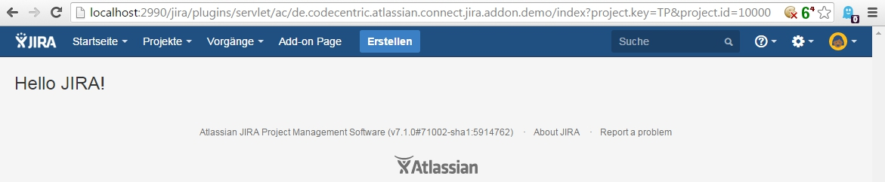

# atlassian-connect-jira-addon

Sample Atlassian JIRA add-on for cloud environment.

Required [Java 8](http://www.oracle.com/technetwork/java/javase/downloads/index.html) and [Atlassian SDK](https://developer.atlassian.com/docs/getting-started/set-up-the-atlassian-plugin-sdk-and-build-a-project).

## how to setup

```
$ git clone https://github.com/s7nio/atlassian-connect-jira-addon.git
$ cd atlassian-connect-jira-addon
$ mvn clean install
$ mvn spring-boot:run
$ # start local jira in cloud mode
$	- ./atlas-run-cloud --application jira-software
$	- OR "./atlas-run-standalone -Dcontainer=tomcat7x -Dproduct=jira -Dproduct.version=7.1.0-OD-05-006 -Dproduct.data.version=7.1.0-OD-05-006 -Dbundled.plugins=com.atlassian.bundles:json-schema-validator-atlassian-bundle:1.0.4,com.atlassian.upm:atlassian-universal-plugin-manager-plugin:2.20.1-D20150924T170115,com.atlassian.jwt:jwt-plugin:1.5.4,com.atlassian.plugins:atlassian-connect-plugin:1.1.68 -Djvmargs=-Datlassian.upm.on.demand=true"
```

## test add-on

- Up and running ([local Add-on](http://localhost:8080/), [local JIRA](http://localhost:2990/jira/))?
- Open [local JIRA Add-on Management Page](http://localhost:2990/jira/plugins/servlet/upm)
- Upload Add-on: *http://localhost:8080/atlassian-connect.json*
- Done



You find more informations on the [Atlassian Connect Dokumentation Website](https://developer.atlassian.com/static/connect/docs/latest/index.html).

Happy add-on development :computer: :shipit:
